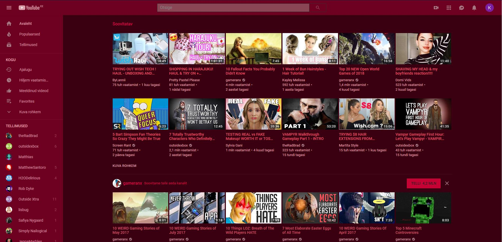
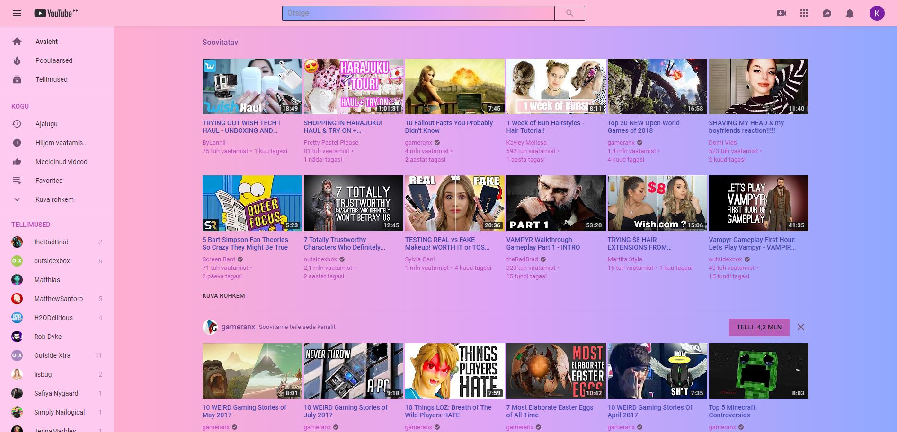
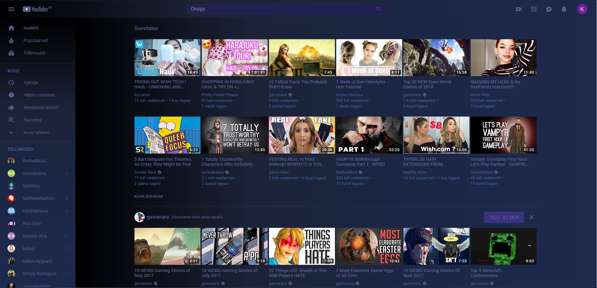
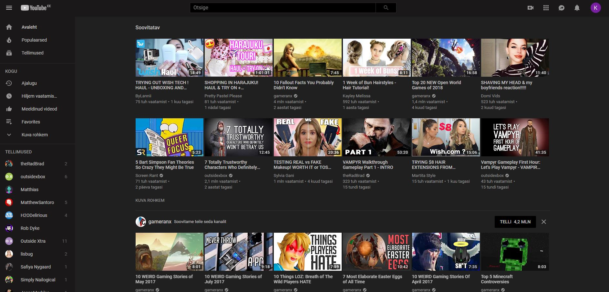
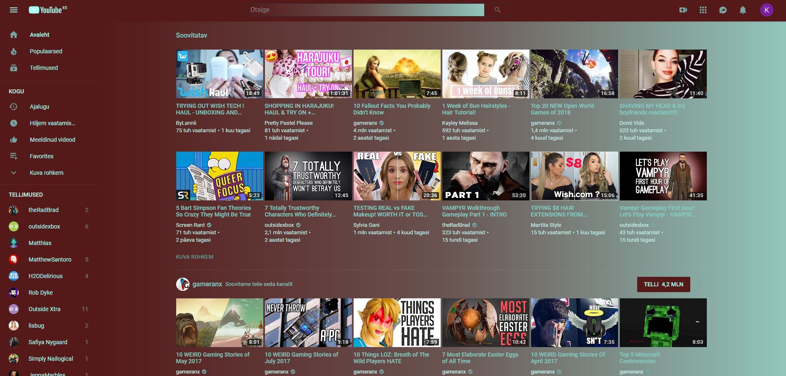
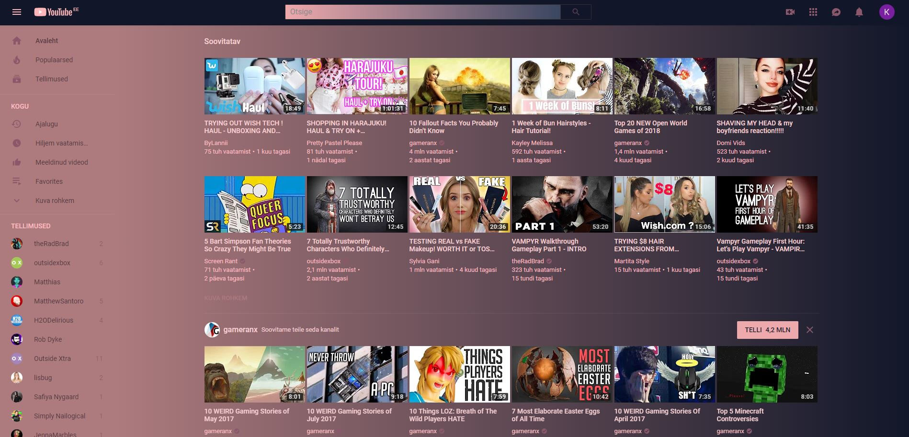
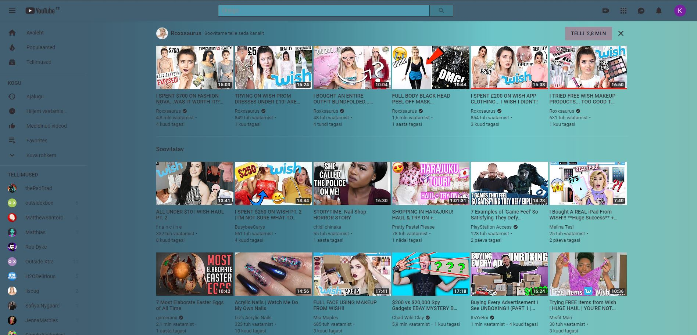
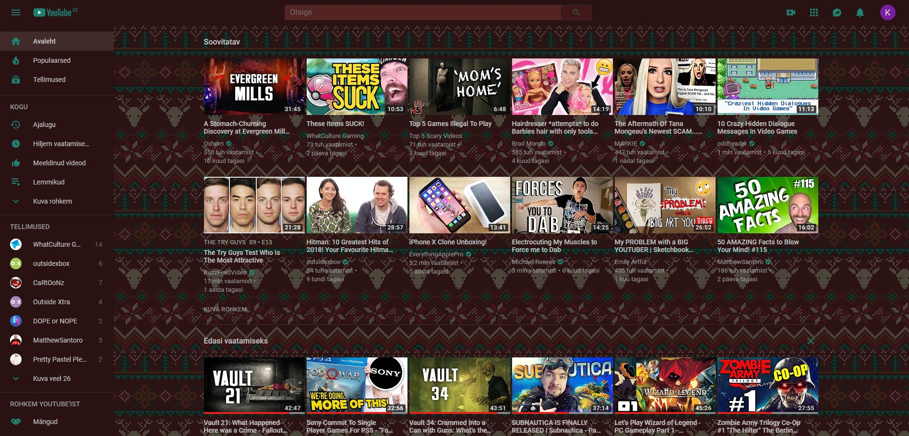

With this extension you can make your youtube experience more colorful.

Red

Pastel

Navy

Gray

Mint

rose

feather

fox

sweater

Other themes will be added over time.
(Icons in popup/options page are mostly from https://www.design-seeds.com/by-collection/ and I do not own any of the pictures used as backgrounds)
